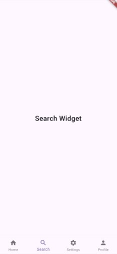

# App-Body
## Table of contents

# App-Body - Application body

**App-Body** is an empty application built using Flutter. It's used as a base to any mobile applications. It has theme manager and internationalization. 

## Table of Contents
- [App-Body](#app-body)
  - [Table of contents](#table-of-contents)
- [App-Body - Application body](#app-body---application-body)
  - [Table of Contents](#table-of-contents-1)
  - [Features](#features)
  - [1. Home Screen](#1-home-screen)
  - [2. Search Screen](#2-search-screen)
  - [3. Profile Screen](#3-profile-screen)
  - [4. Settings Screen](#4-settings-screen)
  - [5. Main Navigation](#5-main-navigation)
  - [6. Localization (l10n)](#6-localization-l10n)
  - [Technical Overview](#technical-overview)
  - [Getting Started](#getting-started)
    - [1. Clone the Repository](#1-clone-the-repository)
    - [2. Navigate to the Project Directory](#2-navigate-to-the-project-directory)
    - [3. Install Dependencies](#3-install-dependencies)
    - [4. Run the App](#4-run-the-app)
      - [Type the following command:](#type-the-following-command)
    - [5. Optional: Running on Specific Platforms](#5-optional-running-on-specific-platforms)
      - [Running on Android:](#running-on-android)
      - [Running on iOS:](#running-on-ios)
    - [6. Optional: Localization (l10n) Support](#6-optional-localization-l10n-support)
  - [Technologies](#technologies)
  - [Authors](#authors)
  - [Screenshots](#screenshots)

## Features

## 1. Home Screen
The Home Screen provides users with an overview of the app, acting as the main entry point for navigation.

- Displays essential app content, including quick access to the search and profile sections.
- Central hub for navigating to other screens, including Search, Profile, and Settings.

## 2. Search Screen
The Search Screen allows users to search any data relative to the application models.

## 3. Profile Screen
The Profile Screen allows users to view and update their personal information, such as username, email, and profile picture.

- View and manage personal profile information.
- Access past and current car rentals.

## 4. Settings Screen
The Settings Screen allows users to customize the app's behavior and appearance according to their preferences.

- Manage notification settings, theme (dark mode/light mode), and privacy controls.
- Provides an interface to manage account-related configurations.

## 5. Main Navigation

The app features a BottomNavigationBar for seamless navigation between the Home, Search, Profile, and Settings screens.

- Persistent navigation using BottomNavigationBar.
- Uses an IndexedStack to maintain the state of screens when switching between tabs.

## 6. Localization (l10n)

The app is fully localized (l10n), supporting multiple languages. It uses the AppLocalizations class to provide a seamless experience for users from different regions.

- Support for multiple languages.
- Localized strings for UI elements like navigation bar labels and screen titles.
- Language fallback mechanism for unsupported locales.

## Technical Overview

## Getting Started

To get started with the app locally, follow these steps:

### 1. Clone the Repository
First, clone the repository to your local machine using Git:
```bash
git clone https://github.com/popcodelab/app_body.git
```

### 2. Navigate to the Project Directory
Once the repository is cloned, navigate into the project directory where the app files are located. Use the following command:

```bash
cd app_body
```

### 3. Install Dependencies
After navigating to the project directory, you need to install all the required dependencies that the app relies on. This can be done using Flutter's package manager.

Run the following command in the terminal:

```bash
flutter pub get
```

### 4. Run the App

#### Type the following command:

```bash
flutter run
```

### 5. Optional: Running on Specific Platforms

If you want to run the app on a specific platform (either Android or iOS), follow these additional steps.

#### Running on Android:
To run the app on an Android device or emulator, use the following command:
```bash
flutter run -d android
```

#### Running on iOS:
To run the app on an iOS device or emulator, use the following command:
```bash
flutter run -d ios
```
### 6. Optional: Localization (l10n) Support
The app supports localization (l10n). To add or modify translations:

- Edit the localization files located in the lib/l10n/ folder.
- Ensure new translations are added in the AppLocalizations class.
- Run the following command to generate localization code:

```
flutter pub run intl_utils:generate
```

## Technologies

<table style="border: none">
<tr style="border: none">
  <td style="border: none">Flutter</td><td style="border: none">
  </td>
</tr>
<tr style="border: none">
  <td style="border: none">Dart</td><td style="border: none">
  </td>
</tr>
<tr style="border: none">
  <td style="border: none">Android</td><td style="border: none">
  </td>
</tr>
<tr style="border: none">
  <td style="border: none">Apple iOS</td><td style="border: none">
  </td>
</tr>

</table>


## Authors

POP's Code Lab~~~~

## Screenshots





---


---
